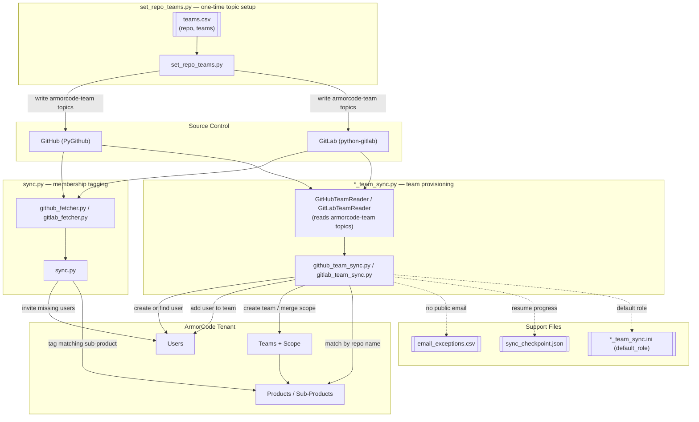

# ac-git-user-provisioning

Syncs GitHub and GitLab users, and their repo access, into ArmorCode. There are two independent pipelines that can be run separately or together:

- **`sync.py`** — invites SCM contributors as ArmorCode users and tags *existing* sub-products with a `members:...` list. Never invents new sub-products unless `--create-missing-subproducts` is passed.
- **`github_team_sync.py` / `gitlab_team_sync.py`** — reads ArmorCode team ownership from repo/project topics (`armorcode-team-<name>` on GitHub, `armorcode-team:<name>` on GitLab) and provisions matching Teams, Users, and product/sub-product scope in ArmorCode.
- **`set_repo_teams.py`** — bulk-applies those `armorcode-team-*` topics to GitLab projects and GitHub repos from a CSV, for setting up the team-sync input at scale instead of one repo at a time.

Both default to `--dry-run`; nothing is written to ArmorCode without `--apply`.

## Design



## `sync.py` flow

1. Fetch every repo the token can see and its members (`github_fetcher.py` / `gitlab_fetcher.py`), falling back to commit-author emails on GitHub when the collaborators endpoint is forbidden.
2. Pull current ArmorCode users, repos, products, and sub-products via `armorcode_client.py` (a thin wrapper over `ac-sdk-v2`).
3. Invite any SCM user not already present in ArmorCode by email.
4. For each repo, look up a sub-product with a matching name and set a `members:<usernames>` tag plus a source tag (`ac-repo-id:...` or `scm-repo:...`). Unmatched repos are skipped and reported unless `--create-missing-subproducts` is passed, in which case a `GitRBAC-Github` / `GitRBAC-Gitlab` product and matching sub-products are created.

## Team-sync flow (`github_team_sync.py` / `gitlab_team_sync.py`)

Each script is self-contained (its own inlined ArmorCode client — no shared import) so either can be handed to a customer independently.

1. Read repo/project topics for the `armorcode-team-*` (GitHub) or `armorcode-team:*` (GitLab) convention to get one or more team names per repo.
2. Read members (direct + inherited group members, Reporter+ on GitLab) and split into those with a resolvable email and those without.
3. For each team name: create the ArmorCode team (scope-only) if missing, or GET the existing team and merge in newly matched product/sub-product scope without dropping anything already scoped.
4. Create any missing ArmorCode user, then add every member to the team via a GET-merge on the user's `teamInfo` (team membership lives on the user record, not the team).
5. Members with no public email are appended to `email_exceptions.csv` instead of being silently dropped. Once an admin fills in the email column by hand, `--reprocess-from-exceptions` provisions them and marks the row `reprocessed`.

Both scripts support `--resume`, checkpointing the last-completed repo/project id (sorted ascending — a stable order across runs) to `sync_checkpoint.json` after every repo so a killed run on a very large tenant (e.g. 100,000+ repos) can continue instead of starting over. The checkpoint clears automatically after a full, unfiltered `--apply` run completes. Use distinct `--checkpoint-file` paths if running both sources around the same time — the file is single-source and a run for the other source ignores it.

Both scripts read `default_role` for newly-created users from their own `.ini` file (`github_team_sync.ini` / `gitlab_team_sync.ini`), overridable with `--default-role`.

### Marking a repo with a team

The team-sync scripts only read topics — something has to set them first. A repo can carry more than one team topic; each becomes a separate team the repo's sub-product gets scoped into.

**GitLab** — topics allow mixed case and colons, so the team name is used as-is: `armorcode-team:<Name>`.

```bash
curl --request PUT --header "PRIVATE-TOKEN: $GITLAB_PAT" \
  --header "Content-Type: application/json" \
  --data '{"topics":["armorcode-team:Web","javascript"]}' \
  "https://gitlab.com/api/v4/projects/julianwayte%2Fjuice-shop"
```

Or with `python-gitlab`:

```python
project.topics = ["armorcode-team:Web", "javascript"]
project.save()
```

**GitHub** — topics are lowercase-alphanumeric-and-hyphens only (max 50 chars, no colons), so the team name is lowercased and hyphenated: `armorcode-team-<name>`.

```bash
curl --request PUT --header "Authorization: Bearer $GITHUB_PAT" \
  --header "Accept: application/vnd.github+json" \
  --data '{"names":["armorcode-team-api"]}' \
  "https://api.github.com/repos/jwayte-armorcode/ac-sdk-v2/topics"
```

**Multiple teams on one repo** — just include more than one `armorcode-team-*` topic:

```bash
# GitLab
--data '{"topics":["armorcode-team:Web","armorcode-team:Checkout"]}'

# GitHub
--data '{"names":["armorcode-team-web","armorcode-team-checkout"]}'
```

### Bulk-marking repos from a CSV (`set_repo_teams.py`)

Setting topics one repo at a time doesn't scale — `set_repo_teams.py` applies them in bulk from a CSV, merging into whatever topics a repo already has (so a `javascript` topic or an existing team topic for a different team is never silently dropped).

```csv
source,repo,teams
gitlab,julianwayte/juice-shop,Web
github,jwayte-armorcode/ac-sdk-v2,API
github,jwayte-armorcode/add_jira_mappings,"Ticketing;Support"
```

- `source`: `gitlab` or `github`
- `repo`: GitLab uses the full `namespace/path`; GitHub uses `owner/repo`
- `teams`: one team name, or several separated by `;` inside a quoted field — a bare `,` can't separate multiple teams, since CSV already uses `,` as the column delimiter and an unquoted `Ticketing,Support` would parse as two extra columns instead of two team names

```bash
# Dry run (default)
python set_repo_teams.py --csv teams.csv --gitlab-env env_gitlab --github-env env_github

# Apply for real — merges new team topics into what's already there
python set_repo_teams.py --csv teams.csv --gitlab-env env_gitlab --github-env env_github --apply

# Replace a repo's team topics entirely with the CSV row's teams
# (non-team topics like "javascript" are still preserved either way)
python set_repo_teams.py --csv teams.csv --gitlab-env env_gitlab --github-env env_github --apply --replace-all-teams
```

## Usage

All commands assume an ArmorCode tenant env file (`token=`/`url=`, or `API_TOKEN`/`TENANT_URL`) and an SCM token env file (`env_github` / `env_gitlab`, or the `--env` default names shown below).

### `sync.py`

```bash
# Dry run (default) — see what would happen, nothing written
python sync.py --source github

# Apply for real — invite missing users, tag existing matching sub-products
python sync.py --source github --apply

# Both sources in one pass, explicit dry run
python sync.py --source all --dry-run

# Use a non-default env file
python sync.py --source gitlab --env ~/my-env --apply

# Opt in to creating sub-products for repos with no existing match
python sync.py --source gitlab --apply --create-missing-subproducts
```

### `gitlab_team_sync.py` / `github_team_sync.py`

```bash
# Dry run against every repo the token can see
python gitlab_team_sync.py --env env_gitlab --ac-env /path/to/tenant/env
python github_team_sync.py --env env_github --ac-env /path/to/tenant/env

# One-off test against a single repo before trusting a full run
python gitlab_team_sync.py --env env_gitlab --ac-env ../tenant/env --repo juice-shop
python github_team_sync.py --env env_github --ac-env ../tenant/env --repo owner/ac-sdk-v2

# Apply for real
python gitlab_team_sync.py --env env_gitlab --ac-env ../tenant/env --repo juice-shop --apply
python github_team_sync.py --env env_github --ac-env ../tenant/env --repo owner/ac-sdk-v2 --apply

# Cap how many repos are processed, e.g. for a quick smoke test
python gitlab_team_sync.py --env env_gitlab --ac-env ../tenant/env --rows 5

# Full run on a very large tenant, resumable if killed partway through
python github_team_sync.py --env env_github --ac-env ../tenant/env --apply --resume

# Re-run after a kill — picks up after the last completed repo id automatically
python github_team_sync.py --env env_github --ac-env ../tenant/env --apply --resume

# Override the default role assigned to newly-created ArmorCode users
python gitlab_team_sync.py --env env_gitlab --ac-env ../tenant/env --apply --default-role "Security Engineer"

# After an admin fills in an email in email_exceptions.csv, provision that person
python gitlab_team_sync.py --env env_gitlab --ac-env ../tenant/env --apply --reprocess-from-exceptions
```

## Safety defaults

- Dry run by default; `--apply` is required to write anything.
- `sync.py` never creates sub-products unless explicitly opted in.
- Team-sync scripts never drop existing team scope or user team memberships — every write is a GET-merge, never a blind overwrite.
- Contributors without a resolvable email are logged, not dropped.
