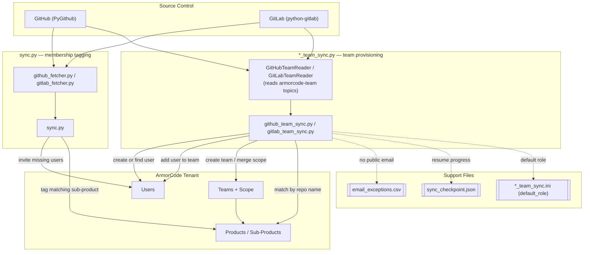

# ac-git-user-provisioning

Syncs GitHub and GitLab users, and their repo access, into ArmorCode. There are two independent pipelines that can be run separately or together:

- **`sync.py`** — invites SCM contributors as ArmorCode users and tags *existing* sub-products with a `members:...` list. Never invents new sub-products unless `--create-missing-subproducts` is passed.
- **`github_team_sync.py` / `gitlab_team_sync.py`** — reads ArmorCode team ownership from repo/project topics (`armorcode-team-<name>` on GitHub, `armorcode-team:<name>` on GitLab) and provisions matching Teams, Users, and product/sub-product scope in ArmorCode.

Both default to `--dry-run`; nothing is written to ArmorCode without `--apply`.

## Design

## `sync.py` flow

1. Fetch every repo the token can see and its members (`github_fetcher.py` / `gitlab_fetcher.py`), falling back to commit-author emails on GitHub when the collaborators endpoint is forbidden.
2. Pull current ArmorCode users, repos, products, and sub-products via `armorcode_client.py` (a thin wrapper over `ac-sdk-v2`).
3. Invite any SCM user not already present in ArmorCode by email.
4. For each repo, look up a sub-product with a matching name and set a `members:<usernames>` tag plus a source tag (`ac-repo-id:...` or `scm-repo:...`). Unmatched repos are skipped and reported unless `--create-missing-subproducts` is passed, in which case a `GitRBAC-Github` / `GitRBAC-Gitlab` product and matching sub-products are created.

## Team-sync flow (`github_team_sync.py` / `gitlab_team_sync.py`)

Each script is self-contained (its own inlined ArmorCode client — no shared import) so either can be handed to a customer independently.

1. Read repo/project topics for the `armorcode-team-*` (GitHub) or `armorcode-team:*` (GitLab) convention to get one or more team names per repo.
2. Read members (direct + inherited group members, Reporter+ on GitLab) and split into those with a resolvable email and those without.
3. For each team name: create the ArmorCode team (scope-only) if missing, or GET the existing team and merge in newly matched product/sub-product scope without dropping anything already scoped.
4. Create any missing ArmorCode user, then add every member to the team via a GET-merge on the user's `teamInfo` (team membership lives on the user record, not the team).
5. Members with no public email are appended to `email_exceptions.csv` instead of being silently dropped. Once an admin fills in the email column by hand, `--reprocess-from-exceptions` provisions them and marks the row `reprocessed`.

Both scripts support `--resume`, checkpointing the last-completed repo/project id (sorted ascending — a stable order across runs) to `sync_checkpoint.json` after every repo so a killed run on a very large tenant (e.g. 100,000+ repos) can continue instead of starting over. The checkpoint clears automatically after a full, unfiltered `--apply` run completes. Use distinct `--checkpoint-file` paths if running both sources around the same time — the file is single-source and a run for the other source ignores it.

Both scripts read `default_role` for newly-created users from their own `.ini` file (`github_team_sync.ini` / `gitlab_team_sync.ini`), overridable with `--default-role`.

## Safety defaults

- Dry run by default; `--apply` is required to write anything.
- `sync.py` never creates sub-products unless explicitly opted in.
- Team-sync scripts never drop existing team scope or user team memberships — every write is a GET-merge, never a blind overwrite.
- Contributors without a resolvable email are logged, not dropped.
