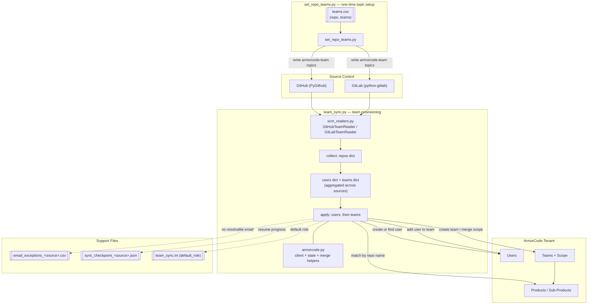

# ac-git-user-provisioning

Provisions ArmorCode Teams, Users, and product/sub-product scope from GitHub and GitLab repo ownership.

Repos declare their owning team with a topic; `team_sync.py` reads those topics and creates the matching teams, users, and access scope in ArmorCode.

- **`team_sync.py`** — the sync. One entry point, selected with `--source github|gitlab|both`.
- **`set_repo_teams.py`** — bulk-applies the `armorcode-team-*` topics to repos from a CSV, for setting up the input at scale instead of one repo at a time.

Dry run is the default; nothing is written to ArmorCode without `--apply`.

## Design



## Flow

The run has two phases: read every SCM into memory, then provision. Nothing is written to ArmorCode until the whole picture is built.

**Phase 1 — collect (no ArmorCode writes)**

1. Read repo topics for the `armorcode-team-*` (GitHub) or `armorcode-team:*` (GitLab) convention to get one or more team names per repo.
2. Read members (direct + inherited group members, Reporter+ on GitLab) and split into those with a resolvable email and those without.
3. Match each repo name to ArmorCode sub-products.
4. Invert that into two maps: **users** keyed by email, and **teams** keyed by name — each team holding the union of its members and sub-products across every repo that names it, from both SCMs.

**Phase 2 — apply (one pass per user, one pass per team)**

5. Create any missing ArmorCode user, once per distinct email.
6. For each team: create it (scope-only) if missing, or GET the existing team and merge in its full scope without dropping anything already scoped. Then add every member via a GET-merge on the user's `teamInfo` (team membership lives on the user record, not the team).
7. Members with no resolvable email are appended to `email_exceptions_<source>.csv` instead of being silently dropped. Once an admin fills in the email column by hand, `--reprocess-from-exceptions` provisions them and marks the row `reprocessed`.

Aggregating before provisioning is what keeps the run cheap. A team owning 25 repos is created, scoped and populated **once** — not 25 times — and a user on 50 repos is evaluated once. Because dict work is free and every API call is paced at 0.6s, this is the difference between hours and minutes on a large tenant:

| Tenant | Per-repo (before) | Aggregated | |
|---|---|---|---|
| 5,000 repos / 200 teams | ~30,000 calls | ~5,900 | 80% fewer |
| 50,000 repos / 800 teams | ~350,000 calls | ~56,600 | 84% fewer |

It also makes the scope write more correct: a team's complete sub-product set is computed in memory and written in a single merge, instead of growing through 25 sequential read-merge-write round trips.

Checkpointing is automatic — no flag required. Every `--apply` run writes the last-completed repo id (sorted ascending, a stable order across runs) to `sync_checkpoint_<source>.json` after each repo, and checks for it at startup: if one exists, the run resumes right after it instead of starting over. A killed run on a very large tenant can simply be restarted with the exact same command. The checkpoint clears automatically once a full, unfiltered `--apply` run completes. The default path is per-source, so a GitHub run and a GitLab run never clobber each other's progress. `email_exceptions_<source>.csv` is per-source for the same reason: it's rewritten whole on every update, so two concurrent runs sharing one path would silently drop each other's rows. Running both sources at once in separate windows is safe on the defaults — override `--checkpoint-file` / `--exceptions-file` to a shared path only if the runs don't overlap.

### Files

| File | Role |
|---|---|
| `team_sync.py` | Entry point, CLI, collect + apply phases |
| `scm_readers.py` | `GitHubTeamReader` / `GitLabTeamReader` behind one interface |
| `armorcode.py` | ArmorCode REST client, cached tenant state, scope/membership merge helpers |
| `email_exceptions.py` | Read/write the no-email exception CSV |
| `sync_checkpoint.py` | Resume checkpoint read/write |
| `set_repo_teams.py` | Bulk topic tagging from a CSV |

## Marking a repo with a team

`team_sync.py` only reads topics — something has to set them first. A repo can carry more than one team topic; each becomes a separate team the repo's sub-product gets scoped into.

**GitLab** — topics allow mixed case and colons, so the team name is used as-is: `armorcode-team:<Name>`.

```bash
curl --request PUT --header "PRIVATE-TOKEN: $GITLAB_PAT" \
  --header "Content-Type: application/json" \
  --data '{"topics":["armorcode-team:Web","javascript"]}' \
  "https://gitlab.com/api/v4/projects/mygroup%2Fjuice-shop"
```

**GitHub** — topics are lowercase-alphanumeric-and-hyphens only (max 50 chars, no colons), so the team name is lowercased and hyphenated: `armorcode-team-<name>`.

```bash
curl --request PUT --header "Authorization: Bearer $GITHUB_PAT" \
  --header "Accept: application/vnd.github+json" \
  --data '{"names":["armorcode-team-api"]}' \
  "https://api.github.com/repos/myorg/my-repo/topics"
```

**Multiple teams on one repo** — just include more than one `armorcode-team-*` topic:

```bash
# GitLab
--data '{"topics":["armorcode-team:Web","armorcode-team:Checkout"]}'

# GitHub
--data '{"names":["armorcode-team-web","armorcode-team-checkout"]}'
```

### Bulk-marking repos from a CSV (`set_repo_teams.py`)

Setting topics one repo at a time doesn't scale — `set_repo_teams.py` applies them in bulk from a CSV, merging into whatever topics a repo already has (so a `javascript` topic or an existing team topic for a different team is never silently dropped).

```csv
source,repo,teams
gitlab,mygroup/juice-shop,Web
github,myorg/ac-sdk-v2,API
github,myorg/add_jira_mappings,"Ticketing;Support"
```

- `source`: `gitlab` or `github`
- `repo`: GitLab uses the full `namespace/path`; GitHub uses `owner/repo`
- `teams`: one team name, or several separated by `;` inside a quoted field — a bare `,` can't separate multiple teams, since CSV already uses `,` as the column delimiter and an unquoted `Ticketing,Support` would parse as two extra columns instead of two team names

```bash
# Dry run (default)
python set_repo_teams.py --csv teams.csv

# Apply for real — merges new team topics into what's already there
python set_repo_teams.py --csv teams.csv --apply

# Replace a repo's team topics entirely with the CSV row's teams
# (non-team topics like "javascript" are still preserved either way)
python set_repo_teams.py --csv teams.csv --apply --replace-all-teams
```

## Usage

Every script reads one env file, `envfile`, holding all credentials — the ArmorCode tenant token plus whichever SCM tokens you need. Copy `env.example` to `envfile` and fill it in; `envfile` is gitignored. Pass `--env /some/other/path` to use a different file.

```
# envfile
TENANT_URL=https://xxxx.armorcode.xxx
API_TOKEN=your-armorcode-api-token
GITLAB_PAT=glpat-...
GITLAB_URL=https://gitlab.com
GITHUB_PAT=github_pat_...
```

`TENANT_URL` is required — there is no default tenant, so an unset value is a hard error rather than a run against somewhere unintended.

```bash
# Start here: dry run against the first 10 repos only.
# --rows caps how many repos are processed, so a first look at a real tenant
# has a small blast radius. It's an upper bound — if the token sees fewer
# than 10 repos the run just processes what exists and finishes normally.
python team_sync.py --source github --rows 10
python team_sync.py --source gitlab --rows 10

# Both SCMs in one run. Preferred when you use both: a team owning repos in
# GitHub AND GitLab becomes one team with the union of its scope and members,
# whereas two separate runs would each write only their own half.
python team_sync.py --source both --rows 10

# Same, but actually write to ArmorCode — an early "does this really work"
# check before committing to the whole org
python team_sync.py --source github --rows 10 --apply

# One-off test against a single repo. Unlike --rows, this pins to one known
# repo rather than exercising the many-repos path
python team_sync.py --source github --repo owner/ac-sdk-v2
python team_sync.py --source gitlab --repo juice-shop

# Full run on a very large tenant — checkpointing is automatic, no flag needed
python team_sync.py --source github --apply

# If it's killed partway through, run the EXACT same command again —
# it reads sync_checkpoint_github.json and picks up after the last completed repo
python team_sync.py --source github --apply

# Override the default role assigned to newly-created ArmorCode users
python team_sync.py --source gitlab --apply --default-role "Security Engineer"

# After an admin fills in an email in email_exceptions_<source>.csv, provision that person
python team_sync.py --source gitlab --apply --reprocess-from-exceptions

# Dump the in-memory picture for review before provisioning anything
python team_sync.py --source both --dump-json
```

### `--source both`

`both` reads GitHub and GitLab in the collect phase, then provisions from the combined picture. Teams are keyed on **name alone**, so `armorcode-team-payments` on a GitHub repo and `armorcode-team:Payments` on a GitLab project resolve to the same ArmorCode team, which ends up scoped to the sub-products of both. Users are deduplicated on lowercased email across sources.

Each SCM keeps its own checkpoint (`sync_checkpoint_github.json`, `sync_checkpoint_gitlab.json`) because they're read separately and a single file couldn't express "GitHub done, GitLab halfway" — so `--checkpoint-file` is rejected with `--source both`. The exceptions CSV defaults to `email_exceptions_both.csv`.

Since `both` provisions one shared user pool, only `[armorcode] default_role` applies; per-source `[github]`/`[gitlab]` sections are ignored, with a warning if they're set.

### `--dump-json`

Writes the collect phase's output for inspection: `repos.json` (per repo: teams, members, matched sub-products), `users.json` (distinct users and which SCMs they came from), `teams.json` (per team: members, sub-product ids, contributing repos). Off by default — on a large tenant `repos.json` is big, and the same information is in the log. Useful for reviewing a run before applying, or for diffing two runs.

### Role for new users

Newly-created ArmorCode users get the `Developer` role by default — both from the shipped `team_sync.ini` and from the built-in fallback, so deleting the ini file doesn't change it. This applies only to users the sync creates; people who already exist in ArmorCode keep whatever role they have.

Precedence, highest first:

| Source | Shipped value |
|---|---|
| `--default-role` | unset |
| `[github]` / `[gitlab]` in `team_sync.ini` | absent (commented out) |
| `[armorcode]` in `team_sync.ini` | `Developer` |
| Built-in fallback | `Developer` |

Every run prints which layer won:

```
[config] new ArmorCode users will be created with role: 'Developer' (from team_sync.ini)
```

The role is validated against the tenant at startup, before any repos are read or anything is written. An unknown name aborts immediately and lists what's available, rather than failing per-user deep into a run with `400 "Provided Tenant Role Not Found"`:

```
[error] role 'developer' does not exist in this tenant.
        Valid roles: Admin, Custom_Developer, DevOps, Developer, Executive, Read Only, Security Engineer
        Set a valid one via --default-role or default_role in team_sync.ini.
```

Matching is exact and case-sensitive — `developer` is rejected, `Developer` is accepted. The valid set is tenant-specific and includes any custom roles (typically `Custom_*`), so it's read live from the tenant rather than hardcoded. Dry runs are validated too, so a `--rows 10` preview catches a bad role before the real run.

## What a dry run looks like

`python team_sync.py --source github --rows 10` against a tenant where the token can see 7 repos:

```
[config] new ArmorCode users will be created with role: 'Developer' (from team_sync.ini)
[armorcode] Loading teams, users, sub-products, business units...
[armorcode] Using business unit: 'Default Organization' (id=4044)
[armorcode] 29 teams, 7 users with email, 36 sub-products

======================================================================
  github -> ArmorCode team sync (DRY RUN)
======================================================================

[github] Fetching and sorting full repo list (by id, for a stable resume order)...
[github] 7 repo(s) visible to this token
[resume] No checkpoint found for github — starting from the beginning

[repo] acme-org/add_jira_mappings  (teams: ticketing)
    members: 3 total, 1 with email, 2 without (cannot provision without email)
    [info] matched sub-product: add_jira_mappings (id=3392790)
    [team] ticketing exists (id=132640)
      [dry_run] would merge scope entries: [{'product': 762317, 'subProduct': [3392790], 'accessOnAllSubProduct': False}]
      [dry_run] would ensure 2 member(s) on team:
        - Ana Ruiz <ana.ruiz@example.com>
        - New Person <new.person@example.com> (would be created)
    [warn] skipped (no public email, cannot provision): sam-lee (sam-lee), dev-bot (dev-bot)

[repo] acme-org/ac-sdk-v2  (teams: api)
    members: 1 total, 0 with email, 1 without (cannot provision without email)
    [info] matched sub-product: ac-sdk-v2 (id=3392789)
    [team] API exists (id=132604)
      [dry_run] would merge scope entries: [{'product': 762317, 'subProduct': [3392789], 'accessOnAllSubProduct': False}]
    [warn] skipped (no public email, cannot provision): dev-bot (dev-bot)

======================================================================
  Done. 7 repo(s) scanned, 2 had armorcode-team topics.
======================================================================
```

Reading this output:

- **Only repos with an `armorcode-team-*` topic are logged.** 5 of the 7 above produced no output at all — they had no team topic and were skipped silently. The `7 repo(s) scanned, 2 had armorcode-team topics` summary is what tells you whether your topic tagging actually landed; a quiet run means "no topics found", not "nothing to do".
- **`api` matched the existing team `API`.** Team lookup is case-insensitive, because GitHub forces topics to lowercase — so a topic-derived `api` finds an existing `API` instead of creating a duplicate.
- **Users are listed by name and email**, with `(would be created)` marking anyone not yet in the tenant.
- **`would merge scope entries` shows the real PUT payload**, with live product and sub-product ids resolved from the tenant.
- **Nothing is written in a dry run** — no ArmorCode changes, no checkpoint, no `email_exceptions_<source>.csv` rows. The no-email warnings are only logged to that CSV on an `--apply` run.

### Progress and rate limits

Every 25 repos the run prints a heartbeat, so a large tenant shows movement instead of looking hung — repos with no team topic produce no other output:

```
[progress] 2500/98431 repos (3%), 214 with team topics, 1.8 repo/s, ~14h50m remaining
```

The denominator is what *this* run will process, so it accounts for `--rows` and for repos already skipped on a checkpoint resume. The rate and ETA are running averages from the start of the run.

ArmorCode enforces these limits:

| Access type | Limit |
|---|---|
| Per API token | 2,000 RPM |
| Per endpoint (token-based) | 100 RPM |
| User session — write | 100 RPM |
| User session — read | 200 RPM |

The per-endpoint limit is the binding one here: a long run calls the same few endpoints repeatedly (one `get_sub_product` per matched sub-product, one user update per member), so it can exceed 100 RPM on a single endpoint while nowhere near the 2,000 RPM token budget. Requests are therefore paced **per endpoint** at 100 RPM (one every 0.6s), bucketed by URL path with numeric ids collapsed — `/api/sub-product/1` and `/api/sub-product/2` share one budget, matching how the server counts them. Unrelated endpoints don't slow each other down.

If a 429 happens anyway, the run **waits it out and carries on** rather than aborting:

```
[rate-limit] GET api/sub-product/{id} -> 429, waiting 30s for the limit to reset (waited 30s total, attempt 1); the run continues automatically
```

Rate limits are transient by definition, so 429s retry until they clear, honouring `Retry-After` when the server sends it and backing off exponentially otherwise. The only bound is a one-hour safety net for a limit that never resets. Server errors (5xx) keep a **bounded** retry count instead, since a 500 can be permanent — ArmorCode returns one for "User Can Not Update Him/Her Self", for instance, and retrying that forever would be indistinguishable from a hang.

### Repos with no matching sub-product

A repo's team scope comes from an ArmorCode sub-product whose name matches the repo name. When there's no match, the team and its users are still provisioned — only the scope is missing. That's easy to lose in a long log, so those repos are also collected and re-listed in the run summary:

```
======================================================================
  Done. 7 repo(s) scanned, 2 had armorcode-team topics.

  1 repo(s) had a team topic but NO matching ArmorCode sub-product.
  Their teams and users were provisioned, but with no product/sub-product
  scope. Create a sub-product whose name matches the repo name (or correct
  the topic), then re-run to attach the scope:
    - acme-org/ac-sdk-v2 (looked for sub-product 'ac-sdk-v2')
======================================================================
```

Each entry names the repo, the sub-product name that was searched for, and the teams involved, so the fix is either creating that sub-product or correcting the repo's topic. Re-running afterwards attaches the scope — the sync never creates sub-products itself. The block is omitted entirely when everything matched, and `--sparse` shows just the count.

For a machine-readable version, add `--unmatched-csv`:

```bash
# Writes unmatched_repos.csv
python team_sync.py --source github --rows 10 --unmatched-csv

# Or name the file
python team_sync.py --source github --apply --unmatched-csv missing_subproducts.csv
```

```csv
source,repo,expected_sub_product,teams
github,acme-org/add_jira_mappings,add_jira_mappings,ticketing
github,acme-org/ac-sdk-v2,ac-sdk-v2,api
```

The file reports that single run, so it's overwritten each time rather than appended — including a header-only file when everything matched, so a previous run's rows can't linger and misreport repos that have since been fixed. It's written in dry runs too, which makes `--rows N --unmatched-csv` a cheap way to plan the missing sub-products before writing anything. Note that a run resuming from a checkpoint only covers the repos it actually processed.

One limitation: dry run reports what it *would* send, not whether that would change anything. `would merge scope entries` prints even when the team is already scoped to those sub-products — on an `--apply` run the same case prints `[noop] scope already covers these sub-products`. To see real change-vs-no-op, run with `--apply`.

### Apply logging and `--sparse`

`--apply` logs the same per-user and scope detail as a dry run, so a real run leaves an auditable record of exactly which users and scope changed — not just how many. Members added on this run are separated from those already on the team:

```
[repo] acme-org/add_jira_mappings  (teams: ticketing)
    members: 4 total, 2 with email, 2 without (cannot provision without email)
    [info] matched sub-product: add_jira_mappings (id=3392790)
    [team] ticketing exists (id=132640)
      [update] scope merged for team 'ticketing'
        scope entries: [{'product': 762317, 'subProduct': [3392790], 'accessOnAllSubProduct': False}]
      [update] added 1 new member(s) to team 'ticketing':
        - new.person@example.com
      [noop] 1 member(s) already on team:
        - Ana Ruiz <ana.ruiz@example.com>
```

Unlike a dry run, apply reports whether each write actually changed anything — `[update]` for a real change, `[noop]` when the team was already scoped or the member was already present.

`--sparse` condenses this to counts only, dropping the indented per-user lists and the scope payload. It applies to dry runs and `--apply` alike. The same repo with `--apply --sparse`:

```
    [team] ticketing exists (id=132640)
      [update] scope merged for team 'ticketing'
      [update] added 1 new member(s) to team 'ticketing'
      [noop] 1 member(s) already on team
```

Default (non-sparse) is the right choice for an auditable record; reach for `--sparse` on very large tenants where per-user output would otherwise dominate the log.

## Safety defaults

- Dry run by default; `--apply` is required to write anything.
- `TENANT_URL` has no default — an unset value is a hard error, never a run against an unintended tenant.
- The role for new users is validated against the tenant before anything is read or written.
- Never drops existing team scope or user team memberships — every write is a GET-merge, never a blind overwrite.
- Sub-products are never created; a repo with no matching sub-product is reported inline *and* re-listed in the run summary, with its team still provisioned, just without that scope.
- Contributors without a resolvable email are logged to `email_exceptions_<source>.csv`, not dropped.
- Requests are paced under ArmorCode's per-endpoint rate limit, and a 429 is waited out rather than aborting the run.
