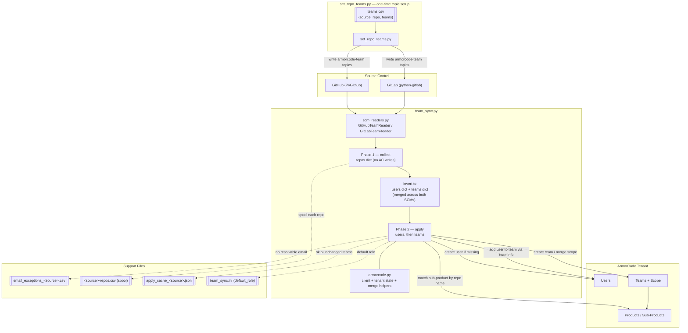

# ac-git-user-provisioning

Provision ArmorCode **teams**, **users**, and **product/sub-product scope** from GitHub and GitLab repo ownership.

Repos declare their owning team with a topic. `team_sync.py` reads those topics and creates the matching teams, users, and access scope in ArmorCode.

```
repo topic  armorcode-team-payments          ArmorCode team "payments"
     +                              ──────►    + members (repo collaborators)
repo members                                   + scope (matching sub-product)
```

Two scripts:

| Script | Purpose |
|---|---|
| **`team_sync.py`** | The sync. One entry point for both SCMs, selected with `--source github\|gitlab\|both`. |
| **`set_repo_teams.py`** | Bulk-applies the team topics to repos from a CSV, for setting up the input at scale. |

Two things to know before running anything:

- **Dry run is the default.** Nothing is written to ArmorCode without `--apply`.
- **The sync is additive-only.** It grants access and never revokes it — there are no `DELETE` calls in the codebase. See [The sync only ever adds](#the-sync-only-ever-adds).

## Contents

- [Quick start](#quick-start)
- [How it works](#how-it-works)
- [Marking a repo with a team](#marking-a-repo-with-a-team)
- [Usage](#usage)
- [Reading the output](#reading-the-output)
- [Durability: resume, caching, rate limits](#durability-resume-caching-and-rate-limits)
- [The sync only ever adds](#the-sync-only-ever-adds)
- [Reference](#reference)

## Quick start

```bash
pip install -r requirements.txt
cp env.example envfile     # then fill in the tokens; envfile is gitignored

# Dry run over the first 10 repos of each source — writes nothing
python team_sync.py --source both --rows 10

# Same, but dump the collected picture to JSON for inspection
python team_sync.py --source both --rows 10 --dump-json

# Write it, still scoped to 10 repos
python team_sync.py --source both --rows 10 --apply

# Then the full run
python team_sync.py --source both --apply
```

`envfile` holds every credential — the ArmorCode tenant plus whichever SCM tokens you need:

```
TENANT_URL=https://xxxx.armorcode.xxx
API_TOKEN=your-armorcode-api-token
GITHUB_PAT=ghp_...
GITLAB_PAT=glpat-...
GITLAB_URL=https://gitlab.com
```

`TENANT_URL` is required and has no default, so an unset value is a hard error rather than a run against somewhere unintended. Token scopes: GitHub needs `repo`, `read:org`, `read:user`; GitLab needs `read_api`, `read_user`.

## How it works



The run has two phases. Nothing is written to ArmorCode until the whole picture is built.

### Phase 1 — collect (no ArmorCode writes)

1. Read each repo's topics for the `armorcode-team-*` (GitHub) or `armorcode-team:*` (GitLab) convention, giving one or more team names per repo.
2. Read its members and split them into those with a resolvable email and those without.
3. Match the repo's **short name** against ArmorCode sub-products (exact, case-insensitive; 0, 1, or many matches).
4. Invert all of that into two maps: **users** keyed by lowercased email, and **teams** keyed by name — each team holding the union of its members and sub-products across every repo that names it, from both SCMs.

Where members come from differs per SCM, because the platforms differ:

| | GitHub | GitLab |
|---|---|---|
| Members | Repo collaborators; falls back to the authors of the last 200 commits if the collaborators endpoint returns 403 | `members_all` (direct **plus** inherited group members), filtered to access level ≥ 30 (Reporter) |
| Email | Public profile email only | Member record email, else a profile fetch (`email` or `public_email`) |

The GitHub fallback matters for a token without the Collaborators permission — it still yields a usable contributor list rather than an empty one.

### Phase 2 — apply (once per user, once per team)

5. Create any missing ArmorCode user, **once per distinct email**.
6. For each team: create it (scope-only) if missing, or GET the existing team and merge its full scope in without dropping anything already scoped. Then add every member.
7. Members whose email the token cannot see are appended to `email_exceptions_<source>.csv` rather than dropped. See [Members without an email](#members-without-an-email).

Team lookup is **case-insensitive**, because GitHub forces topics to lowercase — a topic-derived `api` must find an existing team named `API` instead of creating a duplicate.

### Why aggregate before provisioning

Aggregating is what keeps the run cheap. A team owning 25 repos is created, scoped, and populated **once** — not 25 times — and a user appearing on 50 repos is evaluated once. Dict work is free; every API call is paced at 0.6s. On a large tenant that is the difference between hours and minutes:

| Tenant | Per-repo (naive) | Aggregated | |
|---|---|---|---|
| 5,000 repos / 200 teams | ~30,000 calls | ~5,900 | 80% fewer |
| 50,000 repos / 800 teams | ~350,000 calls | ~56,600 | 84% fewer |

It also makes the scope write **more correct**, not just faster: a team's complete sub-product set is computed in memory and written in a single merge, instead of growing through 25 sequential read-merge-write round trips.

### Two API shapes for the same data

Worth knowing before touching `armorcode.py`. `GET /api/team/{id}` and `PUT /api/team` disagree about the shape of a team's scope:

| | Read (GET response) | Write (PUT body) |
|---|---|---|
| Business unit | nested `businessUnit: {id, name}` | flat `businessUnitId` int |
| Product | nested `product: {id, name}` | flat `product` id |
| Sub-product list | `subProducts` (**plural**), objects | `subProduct` (**singular**), ids |

Sending the read shape back on a PUT returns a 400 — Jackson can't deserialize an object where it expects a plain id. `merge_scope_into_team()` therefore reads, converts every existing entry to the write shape, merges, and returns a body built entirely in write shape.

Membership has a similar trap: **team membership lives on the user record**, not the team. `PUT /user/update/user` replaces a user's entire `teamInfo` list, so `add_user_to_team()` always GET-merges. Two related quirks are handled: the endpoint rejects an empty `teamInfo` (a user must belong to at least one team), and it returns `500 "User Can Not Update Him/Her Self"` if the token's own user tries to update itself. Team creation is also deliberately scope-only — `POST /api/team`'s `members` field rejects any user with account-level access, which is every user this script creates.

## Marking a repo with a team

`team_sync.py` only ever **reads** topics — something has to set them first. A repo may carry more than one team topic; each becomes a separate team that the repo's sub-product is scoped into.

The two conventions differ because the platforms' topic rules do:

| | Convention | Why |
|---|---|---|
| GitLab | `armorcode-team:<Name>` | Topics allow mixed case and colons, so the team name survives as typed |
| GitHub | `armorcode-team-<name>` | Topics are lowercase-alphanumeric-and-hyphens only, max 50 chars, no colons |

```bash
# GitLab
curl --request PUT --header "PRIVATE-TOKEN: $GITLAB_PAT" \
  --header "Content-Type: application/json" \
  --data '{"topics":["armorcode-team:Web","javascript"]}' \
  "https://gitlab.com/api/v4/projects/mygroup%2Fjuice-shop"

# GitHub
curl --request PUT --header "Authorization: Bearer $GITHUB_PAT" \
  --header "Accept: application/vnd.github+json" \
  --data '{"names":["armorcode-team-api"]}' \
  "https://api.github.com/repos/myorg/my-repo/topics"

# Multiple teams on one repo — just include more than one team topic
# GitLab: --data '{"topics":["armorcode-team:Web","armorcode-team:Checkout"]}'
# GitHub: --data '{"names":["armorcode-team-web","armorcode-team-checkout"]}'
```

Both those APIs **replace** the topic list wholesale, so hand-written calls like the above will drop any topic you don't repeat.

### Bulk-marking from a CSV (`set_repo_teams.py`)

Setting topics one repo at a time doesn't scale. `set_repo_teams.py` applies them in bulk, and merges into whatever topics a repo already has — so a `javascript` topic, or a team topic for a different team, is never silently dropped.

```csv
source,repo,teams
gitlab,mygroup/juice-shop,Web
github,myorg/ac-sdk-v2,API
github,myorg/add_jira_mappings,"Ticketing;Support"
```

- `source` — `gitlab` or `github`
- `repo` — GitLab uses the full `namespace/path`; GitHub uses `owner/repo`
- `teams` — one team name, or several separated by `;` **inside a quoted field**. A bare `,` cannot separate teams: CSV already uses `,` as the column delimiter, so an unquoted `Ticketing,Support` parses as two extra columns rather than two team names.

```bash
# Dry run (default)
python set_repo_teams.py --csv teams.csv

# Apply — merges new team topics into what's already there
python set_repo_teams.py --csv teams.csv --apply

# Replace a repo's team topics entirely with this row's teams
# (non-team topics like "javascript" are preserved either way)
python set_repo_teams.py --csv teams.csv --apply --replace-all-teams
```

Team names are slugified for GitHub automatically (lowercased, spaces to hyphens, non-alphanumerics dropped, truncated to 50 chars) and kept as-is for GitLab. A repo whose topics already match prints `[noop]`.

## Usage

```bash
# Start here: dry run over the first 10 repos of each source. --rows caps how
# many repos are processed, so a first look at a real tenant has a small blast
# radius. It's an upper bound — if the token sees fewer than 10, the run just
# processes what exists and finishes normally.
python team_sync.py --source both --rows 10

# Or one SCM at a time, if you only use one or want to stage the rollout
python team_sync.py --source github --rows 10
python team_sync.py --source gitlab --rows 10

# Still writes nothing to ArmorCode: dump what the run collected to
# repos.json, users.json and teams.json. The clearest way to see how the
# pieces fit — which repos map to which teams, which members resolved to an
# email, which sub-products each team would be scoped to.
python team_sync.py --source both --rows 10 --dump-json

# Same 10 repos, but actually write — an early "does this really work" check
# before committing to the whole org
python team_sync.py --source both --rows 10 --apply

# One-off test against a single known repo. Unlike --rows this doesn't
# exercise the many-repos path, so it takes a single source.
python team_sync.py --source github --repo owner/ac-sdk-v2
python team_sync.py --source gitlab --repo juice-shop

# Full run. Spooling and resume are automatic — no flag needed.
python team_sync.py --source both --apply

# If it's killed partway through, re-run the EXACT same command. Each source
# reloads its own spool and picks up after the last spooled repo, so a
# finished GitHub pass is never re-done.
python team_sync.py --source both --apply

# Periodic reconcile — ignores the apply cache and re-checks every team.
# Run this regularly (weekly, say) so hand edits in the ArmorCode UI get
# repaired; an ordinary run cannot see them.
python team_sync.py --source both --apply --full

# Fast interim pass over only repos touched since a date. Opt-in, and NOT a
# substitute for a full run — see the caveats below.
python team_sync.py --source both --apply --changed-since 2026-07-01

# Override the role given to newly-created ArmorCode users
python team_sync.py --source both --apply --default-role "Security Engineer"

# Provision the people whose email an admin has since filled in by hand
python team_sync.py --source both --apply --reprocess-from-exceptions
```

If you use both GitHub and GitLab, prefer `--source both` for real runs. Use a single source when you only have one, or when staging a rollout one SCM at a time.

### `--source both`

`both` reads GitHub **and** GitLab in the collect phase, then provisions from the combined picture. Teams are keyed on **name alone**, so `armorcode-team-payments` on a GitHub repo and `armorcode-team:Payments` on a GitLab project resolve to one ArmorCode team, scoped to the sub-products of both. Users are deduplicated on lowercased email across sources.

Two separate runs would each write only their own half — which is why this matters.

Consequences:

- Each SCM keeps its own spool (`github-repos.csv`, `gitlab-repos.csv`), because they're read separately and one file couldn't express "GitHub done, GitLab halfway". `--spool-file` is therefore **rejected** with `--source both`.
- The exceptions CSV and apply cache default to `email_exceptions_both.csv` and `apply_cache_both.json`.
- Since there's one shared user pool, only `[armorcode] default_role` applies. Per-source `[github]`/`[gitlab]` sections are ignored, with a warning if set.

### Members without an email

ArmorCode identifies users by email, so a member whose email the token cannot see **cannot be provisioned**. This is the common case, not an edge case: GitHub emails are private unless the user publishes one, and GitLab only exposes an email to a sufficiently privileged token.

Those members are never silently dropped. They're appended to `email_exceptions_<source>.csv` with a blank email column:

```csv
source,repo,team,username,name,email,first_seen,status
github,acme-org/ac-sdk-v2,api,sam-lee,Sam Lee,,2026-07-31,pending
```

An admin tracks the address down out-of-band, fills in the `email` column, and re-runs:

```bash
python team_sync.py --source both --apply --reprocess-from-exceptions
```

That mode creates the user if needed, adds them to the team named in their row, and flips `status` to `reprocessed` — but **only for rows whose team add succeeded**. It's a targeted pass, not a sync: it does no SCM read and does not re-scope teams, so if the team no longer exists it tells you to run the normal sync first. Rows are deduplicated on `(source, repo, team, username)`, so repeated syncs don't pile up duplicates.

Match the `--source` flag to the run that produced the file (`--source both` reads `email_exceptions_both.csv`).

### Role for new users

Newly-created ArmorCode users get `Developer` — from both the shipped `team_sync.ini` and the built-in fallback, so deleting the ini doesn't change the behaviour. This applies **only to users the sync creates**; people who already exist in ArmorCode keep whatever role they have.

Precedence, highest first:

| Source | Shipped value |
|---|---|
| `--default-role` | unset |
| `[github]` / `[gitlab]` in `team_sync.ini` | absent (commented out) |
| `[armorcode]` in `team_sync.ini` | `Developer` |
| Built-in fallback | `Developer` |

Every run prints which layer won:

```
[config] new ArmorCode users will be created with role: 'Developer' (from team_sync.ini)
```

The role is validated against the tenant **at startup**, before any repos are read or anything is written. An unknown name aborts immediately and lists what's available, rather than failing per-user deep into a long run with `400 "Provided Tenant Role Not Found"`:

```
[error] role 'developer' does not exist in this tenant.
        Valid roles: Admin, Custom_Developer, DevOps, Developer, Executive, Read Only, Security Engineer
        Set a valid one via --default-role or default_role in team_sync.ini.
```

Matching is exact and case-sensitive — `developer` is rejected, `Developer` accepted. The valid set is tenant-specific and includes custom roles (typically `Custom_*`), so it's read live rather than hardcoded. Dry runs are validated too, so a `--rows 10` preview catches a bad role before the real run.

## Reading the output

`python team_sync.py --source github --rows 10`, against a tenant where the token can see 7 repos:

```
[config] new ArmorCode users will be created with role: 'Developer' (from team_sync.ini)
[armorcode] Loading teams, users, sub-products, business units...
[armorcode] Using business unit: 'Default Organization' (id=4044)
[armorcode] 29 teams, 7 users with email, 36 sub-products

======================================================================
  github -> ArmorCode team sync (DRY RUN)
======================================================================

[resume] github: no spool found — starting from the beginning
[github] Fetching and sorting full repo list (by id, for a stable resume order)...
[github] 7 repo(s) visible to this token

[repo] acme-org/add_jira_mappings  (teams: ticketing)
    members: 3 total, 1 with email, 2 without (cannot provision without email)
    [info] matched sub-product: add_jira_mappings (id=3392790)
    [warn] skipped (no public email, cannot provision): sam-lee (sam-lee), dev-bot (dev-bot)

[repo] acme-org/ac-sdk-v2  (teams: api)
    members: 1 total, 0 with email, 1 without (cannot provision without email)
    [info] matched sub-product: ac-sdk-v2 (id=3392789)
    [warn] skipped (no public email, cannot provision): dev-bot (dev-bot)

----------------------------------------------------------------------
  Users: 2 distinct member(s) with a resolvable email
----------------------------------------------------------------------
  [dry_run] 1 already exist, 1 would be created:
    - New Person <new.person@example.com>

----------------------------------------------------------------------
  Teams: 2
----------------------------------------------------------------------

[team] api  (1 repo(s), 0 member(s), 1 sub-product(s))
    [team] exists (id=132604)
      [dry_run] would merge scope entries: [{'product': 762317, 'subProduct': [3392789], 'accessOnAllSubProduct': False}]

[team] ticketing  (1 repo(s), 2 member(s), 1 sub-product(s))
    [team] exists (id=132640)
      [dry_run] would merge scope entries: [{'product': 762317, 'subProduct': [3392790], 'accessOnAllSubProduct': False}]
      [dry_run] would ensure 2 member(s) on team:
        - Ana Ruiz <ana.ruiz@example.com>
        - New Person <new.person@example.com> (would be created)

======================================================================
  Done. 7 repo(s) scanned, 2 had armorcode-team topics -> 2 team(s), 2 user(s).
======================================================================
```

The two phases are visible: the per-repo blocks are collect reading the SCM; `Users:` and `Teams:` are apply working from the aggregated maps.

What to take from this:

- **Only repos with a team topic are logged.** Five of the seven produced no output at all — they had no topic and were skipped silently. The `7 repo(s) scanned, 2 had armorcode-team topics` line is what tells you whether your tagging actually landed. A quiet run means "no topics found", not "nothing to do".
- **`api` matched the existing team `API`** — team lookup is case-insensitive, so a lowercase GitHub topic doesn't create a duplicate.
- **`would merge scope entries` is the real PUT payload**, with live product and sub-product ids resolved from the tenant.
- **Nothing is written in a dry run** — no ArmorCode changes, no spool, no exception-CSV rows. The no-email warnings only reach the CSV on an `--apply` run.
- **One limitation of dry run:** it reports what it *would* send, not whether that would change anything. `would merge scope entries` prints even when the team is already scoped to those sub-products. Only `--apply` distinguishes real change from no-op.

### `--apply` logging

`--apply` logs the same per-user and scope detail, so a real run leaves an auditable record of exactly *which* users and scope changed — not just how many. Unlike a dry run it reports whether each write changed anything, and separates members added on this run from those already present:

```
[team] ticketing  (1 repo(s), 2 member(s), 1 sub-product(s))
    [team] exists (id=132640)
      [update] scope merged for team 'ticketing'
        scope entries: [{'product': 762317, 'subProduct': [3392790], 'accessOnAllSubProduct': False}]
      [update] added 1 new member(s) to team 'ticketing':
        - new.person@example.com
      [noop] 1 member(s) already on team:
        - Ana Ruiz <ana.ruiz@example.com>
```

This is the record of who was granted what, so it's worth capturing rather than watching scroll past — `--apply 2>&1 | tee run.log` on a long run.

### Repos with no matching sub-product

A team's scope comes from an ArmorCode sub-product whose name matches the repo's short name. When nothing matches, **the team and its users are still provisioned** — only the scope is missing. That's easy to lose in a long log, so those repos are collected and re-listed in the run summary:

```
  1 repo(s) had a team topic but NO matching ArmorCode sub-product.
  Their teams and users were provisioned, but those repos contribute no
  product/sub-product scope. Create a sub-product whose name matches the
  repo name (or correct the topic), then re-run to attach the scope:
    - acme-org/ac-sdk-v2 (looked for sub-product 'ac-sdk-v2', teams: api)
```

Each entry names the repo, the sub-product name searched for, and the teams involved, so the fix is either creating that sub-product or correcting the topic. Re-running afterwards attaches the scope — **the sync never creates sub-products itself.** The block is omitted entirely when everything matched.

For a machine-readable version, add `--unmatched-csv`:

```bash
python team_sync.py --source github --rows 10 --unmatched-csv          # unmatched_repos.csv
python team_sync.py --source github --apply --unmatched-csv missing.csv # or name it
```

```csv
source,repo,expected_sub_product,teams
github,acme-org/ac-sdk-v2,ac-sdk-v2,api
```

The file reports **that single run**, so it's overwritten each time rather than appended — including a header-only file when everything matched, so a previous run's rows can't linger and misreport repos that have since been fixed. It's written in dry runs too, which makes `--rows N --unmatched-csv` a cheap way to plan the missing sub-products before writing anything. Note that a run resuming from a spool only covers the repos it actually re-read.

If a repo name matches **several** sub-products, the team is scoped to all of them, and the run says so:

```
    [info] 2 matching sub-products found — scoping team to all: api(id=1), api(id=2)
```

### Progress and ETA

Every 25 repos the run prints a heartbeat, so a large tenant shows movement rather than looking hung — repos with no team topic produce no other output:

```
[progress] github: 2500/98431 repos (3%), 214 with team topics, 1.8 repo/s, ~14h50m remaining
```

The denominator is what *this* run will process, so it accounts for `--rows` and for repos already skipped on a spool resume. Rate and ETA are running averages from the start of the run.

## Durability: resume, caching, and rate limits

Three separate mechanisms, aimed at making a multi-hour run over a large tenant survivable and repeatable.

### Resume after a crash

Collecting 100,000 repos takes hours, so collect **spools each repo to CSV as it reads it** — `github-repos.csv`, `gitlab-repos.csv` — flushed and `fsync`ed per row, so a killed container can't lose rows sitting in a buffer. On restart the run reloads those rows and continues after the highest repo id present.

```
[resume] github: reloaded 41802 repo(s) with teams from github-repos.csv, resuming after repo id 743119288
```

The spool holds the collected **data**, not just a position. That distinction is the entire point: a position-only checkpoint would tell a resumed run "99,000 repos done" while their teams and members existed only in the dead run's memory — so it would provision from the last 1,000 and silently drop the rest, *while looking like it succeeded*. (CSV over JSON for the same reason: a JSON array can't be appended to without a rewrite, and a half-written array is unparseable.)

Details worth knowing:

- Repos are sorted **by id**, not name, so the resume order is stable across runs. Ids never change, so "last completed id" means the same thing even if repos are added, removed, or renamed in between.
- Sources are read in a fixed order (GitHub, then GitLab) and each keeps its own spool, so dying partway through GitLab doesn't re-read the 50,000 GitHub repos already gathered.
- Repos with **no** team topic contribute no data but still advance the resume position, so a long stretch of untagged repos isn't re-read either.
- The spool is deleted only after collect **and** apply have both finished. Clearing it earlier would mean a crash during apply lost everything.
- A `--repo` / `--rows` / `--changed-since` run **keeps** its spool, since a partial pass isn't a valid "we got this far" marker.
- Dry runs never write one — previewing must not create a resume position that makes the next real run skip repos it never provisioned.
- A hard kill can leave a half-written final line. Any row with a missing column is dropped, so that repo is simply re-read. Safe, because collect is idempotent.

`email_exceptions_<source>.csv` is per-source for a different reason: it's rewritten whole on every update, so two concurrent runs sharing one path would silently drop each other's rows. Running both sources at once in separate windows is safe on the defaults.

### Skipping unchanged work

Two independent opt-out-able mechanisms for cutting the cost of a repeat run.

**`apply_cache_<source>.json` — skip teams that haven't changed.** After a team is successfully provisioned, its desired state (members, sub-product ids, role) is recorded. The next run skips any team whose desired state is identical, without calling ArmorCode at all:

```
[team] Payments  [cached] unchanged since last run — skipped

  [cached] 198 of 200 team(s) unchanged since the last run — skipped without calling ArmorCode.
           Run with --full to reconcile everything, including any team
           edited directly in the ArmorCode UI since then.
```

The fingerprint deliberately **excludes which repos** contributed a team — that has no bearing on the API calls made, and including it would force a pointless re-provision every time an untagged repo was renamed or a second repo joined a team that already had the same scope.

This is a **fast path, not a source of truth.** The cache knows what the last run provisioned; it cannot know whether ArmorCode still matches. If an admin removes a member from a team in the UI, the cache still says "unchanged" and the drift persists. Three guards bound that:

- Entries are written **only after** that team's API calls succeed — never in bulk at the end, so a partially failed run can't record work it didn't do. A team that errored prints `[cache] not recording … will be retried next run`.
- The file is stamped with the **tenant URL and a schema version**; a cache from another tenant or an older layout is rejected wholesale rather than half-applied.
- **`--full` ignores the cache** entirely and reconciles everything. Run it periodically — weekly, say — to repair hand edits. `--full` still *rewrites* the cache from what it provisions, so the next ordinary run gets a fresh fast path.

The cache applies to **teams**. Users are cheap by comparison — existence is checked against the tenant user list already loaded at startup, so a repeat run makes no per-user calls for people who already exist.

**`--changed-since YYYY-MM-DD` — skip repos that haven't changed.** Opt-in, and deliberately not the default, because SCM repo timestamps do not move for everything this sync reads:

- A member **publishing their email** changes their user profile, not the repo. This is the one that matters most: anyone sitting in `email_exceptions_<source>.csv` is waiting for exactly that, and a filtered run would never pick them up.
- Gaining access via a **GitHub org team** or **GitLab parent group** changes the org/group record.
- A collaborator being **removed** likewise.

So use it for a fast interim pass, never as a replacement for a full run. On GitLab it's a real server-side filter (`last_activity_after`, so fewer pages fetched); on GitHub the repo list is still paginated in full and the filter applied client-side, which saves the per-repo calls but not the listing.

It also gets its own spool namespace (`<source>-repos-changed.csv`). Resume works by skipping every id at or below the highest recorded, which is only valid for a contiguous walk — a sparse `--changed-since` set would otherwise make a later full run skip lower-numbered repos it never collected.

### Rate limits

ArmorCode enforces:

| Access type | Limit |
|---|---|
| Per API token | 2,000 RPM |
| Per endpoint (token-based) | 100 RPM |
| User session — write | 100 RPM |
| User session — read | 200 RPM |

The **per-endpoint** limit is the binding one here. A long run calls the same few endpoints repeatedly (one `get_sub_product` per matched sub-product, one user update per member), so it can exceed 100 RPM on a single endpoint while nowhere near the 2,000 RPM token budget.

Requests are therefore paced **per endpoint** at 100 RPM (one every 0.6s), bucketed by URL path with numeric ids collapsed — `/api/sub-product/1` and `/api/sub-product/2` share one budget, matching how the server counts them. Unrelated endpoints don't slow each other down.

Resolved emails are also cached per run, in both readers. Reading a member's email is a full profile fetch and the same person usually appears on many repos; without the cache a user on 50 repos costs 50 identical calls to the same rate-limited endpoint. **Misses are cached too**, since members with no visible email are the common case and recur just as often.

If a 429 happens anyway, the run **waits it out and carries on** rather than aborting:

```
[rate-limit] GET api/sub-product/{id} -> 429, waiting 30s for the limit to reset (waited 30s total, attempt 1); the run continues automatically
```

Rate limits are transient by definition, so 429s retry until they clear — honouring `Retry-After` when sent, backing off exponentially otherwise, with a one-hour safety net for a limit that never resets. **Server errors (5xx) keep a bounded retry count instead** (8 attempts), because a 500 can be permanent: ArmorCode returns one for "User Can Not Update Him/Her Self", and retrying that forever would be indistinguishable from a hang. Each 5xx retry is logged for the same reason.

## The sync only ever adds

This tool is **additive-only**. It never removes a user from a team, never removes sub-product scope, and never deletes a team or user. There are no `DELETE` calls in the codebase at all, and the two endpoints that replace a whole list — `PUT /api/team` for scope and `PUT /user/update/user` for membership — always have their bodies built by **union**, never by assignment:

```
team already scoped to subs 1,2,3 (product 700) + sub 50 (product 800)
sync computes that it wants sub 9 (product 700)
result: product 700 -> [1,2,3,9]   product 800 -> [50]      # nothing lost
```

```
user already on teams 10 (Developer), 11 (Admin)
sync adds team 12
result: [10 Developer, 11 Admin, 12 Developer]              # roles preserved too
```

**Why.** A repo topic states who *should* have access; it says nothing about who shouldn't. The token may not even see every repo in the org, so absence from the collected set is not evidence that access should be revoked. Removing on that basis could silently strip access from people whose repos this run simply couldn't read.

In practice:

- **De-provisioning is out of scope.** If someone leaves a team, remove them in ArmorCode — no run will do it for you. Deleting the repo topic stops *future* runs re-adding them, but does not undo what's already there.
- A member added by hand in the ArmorCode UI is never removed, so the end state converges on "what the repos say **plus** whatever was already there" — not a strict mirror of the repos.
- `--full` therefore repairs **removals** but not **additions**: a member deleted from a team in the UI is put back, because the repos still say they belong; a member added in the UI stays.

## Reference

### Files

| File | Role |
|---|---|
| `team_sync.py` | Entry point, CLI, collect + apply phases |
| `scm_readers.py` | `GitHubTeamReader` / `GitLabTeamReader` behind one interface |
| `armorcode.py` | ArmorCode REST client, cached tenant state, scope/membership merge helpers |
| `email_exceptions.py` | Read/write the no-email exception CSV |
| `repo_spool.py` | Durable per-repo CSV spool, and resume from it |
| `apply_cache.py` | Cross-run cache of provisioned state, to skip unchanged teams |
| `set_repo_teams.py` | Bulk topic tagging from a CSV |
| `team_sync.ini` | `default_role` for newly-created users |
| `env.example` | Template for `envfile` (gitignored) |

Generated files — all gitignored, all regenerated per run: `<source>-repos.csv` (spool), `apply_cache_<source>.json`, `email_exceptions_<source>.csv`, `unmatched_repos.csv`, and `repos.json` / `users.json` / `teams.json` from `--dump-json`.

`armorcode.py` is an inlined subset of [ac-sdk-v2](https://github.com/jwayte-armorcode/ac-sdk-v2)'s client, kept local so this tool has no dependency on the SDK package. If you need another endpoint, port the method across rather than reintroducing that dependency.

### `team_sync.py` flags

| Flag | Default | Purpose |
|---|---|---|
| `--source github\|gitlab\|both` | *required* | Which SCM(s) to read. `both` merges them into one picture before provisioning. |
| `--apply` | off (dry run) | Write to ArmorCode. Mutually exclusive with `--dry-run`. |
| `--env PATH` | `envfile` | Credentials file. |
| `--rows N` | all | Process at most N repos. An upper bound, for a small-blast-radius test. |
| `--repo NAME` | all | Single repo. GitHub `owner/name`; GitLab short path or `namespace/path`. |
| `--config PATH` | `team_sync.ini` | Where `default_role` is read from. |
| `--default-role ROLE` | from ini | Role for newly-created users. Validated at startup. |
| `--full` | off | Ignore the apply cache; reconcile every team. Repairs UI drift. |
| `--changed-since DATE` | off | Only repos updated on/after `YYYY-MM-DD`. Opt-in; see the caveats. |
| `--cache-file PATH` | `apply_cache_<source>.json` | Cross-run apply cache. |
| `--spool-file PATH` | `<source>-repos.csv` | Resume spool. Rejected with `--source both`. |
| `--exceptions-file PATH` | `email_exceptions_<source>.csv` | No-email exception log. |
| `--reprocess-from-exceptions` | off | Instead of a sync, provision exception rows whose email is now filled in. |
| `--unmatched-csv [PATH]` | off / `unmatched_repos.csv` | Also write unmatched repos to CSV. |
| `--dump-json` | off | Write `repos.json`, `users.json`, `teams.json` from the collect phase. |

### Safety defaults

- Dry run by default; `--apply` is required to write anything.
- `TENANT_URL` has no default — an unset value is a hard error, never a run against an unintended tenant.
- The role for new users is validated against the tenant before anything is read or written.
- Existing team scope and user team memberships are never dropped: every write is a GET-merge, never a blind overwrite. See [The sync only ever adds](#the-sync-only-ever-adds).
- Business unit ids are resolved from the tenant by name, never hardcoded.
- Sub-products are never created. A repo with no match is reported inline *and* re-listed in the summary, with its team still provisioned, just without that scope.
- Contributors without a resolvable email are logged, not dropped.
- Requests are paced under the per-endpoint rate limit; a 429 is waited out rather than aborting the run.
- The apply cache is written only for teams whose API calls succeeded, and `--full` always reconciles from scratch.
- `--changed-since` is opt-in, never the default, because repo timestamps don't reflect user- or group-side changes.
